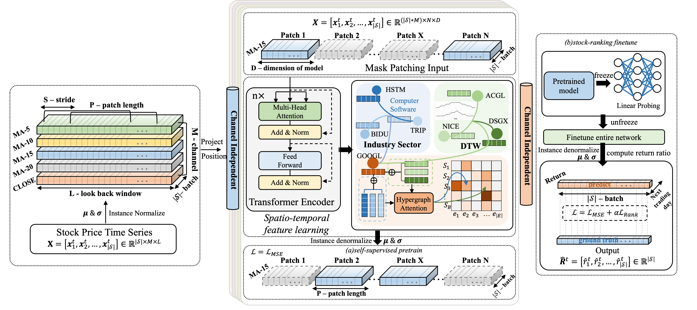

# CI-STHPAN: Pre-Trained Attention Network for Stock Selection with Channel-Independent Spatio-Temporal Hypergraph [[paper pdf]](https://ojs.aaai.org/index.php/AAAI/article/view/28770)



Quantitative stock selection is one of the most challenging FinTech tasks due to the non-stationary dynamics and complex market dependencies. Existing studies rely on channel mixing methods, exacerbating the issue of distribution shift in financial time series. Additionally, complex model structures they build make it difficult to handle very long sequences. Furthermore, most of them are based on predefined stock relationships thus making it difficult to capture the dynamic and highly volatile stock markets. To address the above issues, in this paper, we propose Channel-Independent based Spatio-Temporal Hypergraph Pre-trained Attention Networks (CI-STHPAN), a two-stage framework for stock selection, involving Transformer and HGAT based stock time series self-supervised pre-training and stock-ranking based downstream task fine-tuning. We calculate the similarity of stock time series of different channel in dynamic intervals based on Dynamic Time Warping (DTW), and further construct channel-independent stock dynamic hypergraph based on the similarity. Experiments with NASDAQ and NYSE markets data over five years show that our framework outperforms SOTA approaches in terms of investment return ratio (IRR) and Sharpe ratio (SR). Additionally, we find that even without introducing graph information, self-supervised learning based on the vanilla Transformer Encoder also surpasses SOTA results. Notable improvements are gained on the NYSE market. It is mainly attributed to the improvement of fine-tuning approach on Information Coefficient (IC) and Information Ratio based IC (ICIR), indicating that the fine-tuning method enhances the accuracy and stability of the model prediction.

## Install environment

Init environment using conda

```
conda create -n ci-sthpan python=3.10.12

conda activate ci-sthpan
```

Install pytorch

```
conda install pytorch torchvision torchaudio pytorch-cuda=11.8 -c pytorch -c nvidia
```

Install torch geometric: Please follow [these instructions](https://pytorch-geometric.readthedocs.io/en/latest/notes/installation.html).
For our environment, we use the command:

```
conda install pyg -c pyg
```

Install other packages:

```
pip install -r requirements.txt
```

## Data & Models

Datasets: [Link](https://pan.baidu.com/s/12SgBKg50pG-F3SpQA_x0tQ) Code: 2vqs

Pretrained models：[Link](https://pan.baidu.com/s/1HGJ0sAriVLRhc7KqkLC51w) Code: h729

## Example

Pre-training and fine-tuning of hypergraphs constructed based on wikidata relations on NASDAQ is shown here as an example.

### Pretrain

```
cd ./CI-STHPAN_self_supervised
bash ./scripts/pretrain/pre_graph_wiki.sh
```

### Finetune

```
cd ./CI-STHPAN_self_supervised
bash ./scripts/finetuned/[27]graph_wiki.sh
```

## A-Share (CSI300) Adaptation

We provide scripts to adapt CI-STHPAN for the China A-Share market using CSI300 constituent stocks via Qlib data.

**Data summary:**
- Time range: 2020-01-02 ~ 2026-03-20 (1504 trading days)
- Universe: CSI300 constituent stocks (union), 481 tickers
- Train: day 0–901 (902 days), Val: day 902–1202 (301 days), Test: day 1203–1503 (301 days)

### Step 1: Convert Qlib data to CSV

Place your Qlib data under `my_qlib_data/` (with `calendars/`, `instruments/`, `features/` subdirectories), then run:

```
cd ./CI-STHPAN_self_supervised
python scripts/step1_qlib_to_csv.py
```

This generates per-stock CSVs under `src/data/datasets/stock/2020-01-02/`, a ticker list, and a trading calendar file.

### Step 2: Pretrain (A-Share)

```
cd ./CI-STHPAN_self_supervised
bash ./scripts/pretrain/pre_ashare.sh
```

### Step 3: Finetune (A-Share)

```
cd ./CI-STHPAN_self_supervised
bash ./scripts/finetune/ft_ashare.sh
```

The finetune script loops over alpha values (1, 2, 4, 6, 8, 10) — select the best based on validation loss.


